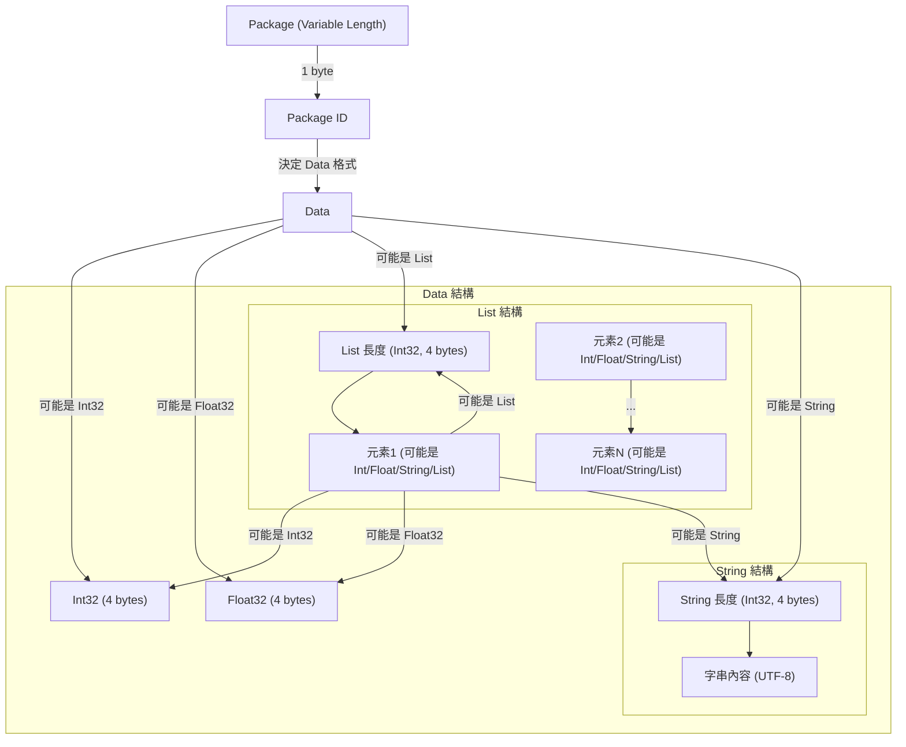

### 如何使用這個common

- 直接使用

```
cd /your/project/folder/
git clone https://github.com/YunTechAi-FreeSpaceTechnic/common.git
```

- 作為子模𧇿使用

```
cd /your/project/folder/
git submodule add https://github.com/YunTechAi-FreeSpaceTechnic/common.git common
```

[建立模型時的範例和說明 /example/build_model.py](https://github.com/YunTechAi-FreeSpaceTechnic/common/blob/main/example/build_model.py)  
[呼叫模型時的範例和說明 /example/invoke_model.py](https://github.com/YunTechAi-FreeSpaceTechnic/common/blob/main/example/invoke_model.py)

## Template

[repository](https://github.com/YunTechAi-FreeSpaceTechnic/model-template)

## Protocol Format



### 🎯 **完整封包結構**

1. **Package ID (1 byte)**

   - 決定 Data 格式

2. **Data（根據 ID 決定格式）**：
   - **Int32 (4 bytes)**
   - **Float32 (4 bytes)**
   - **List**：
     - `Int32 (4 bytes)` → **List 長度**
     - 多個 `data`（可以是 Int、Float、String 或 List）
   - **String**：
     - `Int32 (4 bytes)` → **字串長度**
     - `UTF-8 編碼字串`
